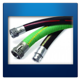

# Practica01-My-Blog
Práctica de html

1. Crear un repositorio en GitHub con el nombre “Practica01 – Mi Blog”

2. Realizar un commit y push por cada requerimiento de los puntos antes descritos.

3. Al finalizar la práctica se debe validar todas las páginas HTML creadas usando el W3C Validator.

Validación de página Index.html

Validación de página Contacto.html

Validación de pagina nosotros.html

Validación de pagina servicios.html

Validación de página ubicación.html

4. Luego, se debe crear el archivo README del repositorio de GitHub.

5. Generar informe de los resultados en el formato de prácticas. Debe incluir:
       a. El desarrollo de cada uno de los puntos antes descritos así como las etiquetas HTML utilizadas para resolver cada punto.
<!DOCTYPE html>
<html>
    <head>
        <meta charset="utf-8"/>
        <meta name="keywords" content="manguera, importación, import"/>
        <link type="text/css" rel="stylesheet" href="./css/estilos.css">
        <title>Inicio</title>
    </head>
    <body>
        <header class="cabecera">
            
            <ul class="menunavegador">
                <li><a href="index.html">INICIO</a></li>
                <li><a href="./documentos/general/nosotros.html">NOSOTROS</a></li>
                <li><a href="./documentos/general/servicios.html">SERVICIOS</a></li>
                <li><a href="./documentos/general/contacto.html">CONTACTANOS</a></li>
                <li><a href="./documentos/mobile/ubicacion.html">UBICANOS</a></li>
            </ul>
        </header>
           
        
        <section class="seccion">
            
            <article class="indexcontenido">
                <h3>Article</h3>
                En <em>Import Mangueras IB</em> tenemos más de 20 años de experiencia como distribuidores de mangueras industriales, accesorios, refacciones y suministros de este tipo. Somos la opción ideal para el sector hidráulico y neumático, ya que damos soluciones integrales a las empresas de Apodaca y toda el área metropolitana.
                Nuestros ejecutivos están experimentados y capacitados para dar asesoría técnica sobre cada producto que comercializamos, incluyendo especificaciones técnicas y usos.
            </article>
            <aside class="imgcontenido">
                
                
                
            </aside>
            <aside class="imgcontenido1">
                
            </aside>
        </section>
        
        <section class="seccion">
            <article class="indexcontenido">
                Lorem ipsum dolor sit amet consectetur adipisicing elit. Pariatur mollitia expedita sit quam voluptatum itaque accusamus ipsa optio illo quidem dignissimos, reprehenderit quibusdam vel eius! Culpa asperiores sequi aspernatur maxime?
            Lorem ipsum dolor sit amet, consectetur adipisicing elit. Pariatur, quidem. Excepturi magnam voluptas eaque repellat laboriosam ipsa, illum dolores quis aut voluptatem ad in? Nostrum accusamus excepturi sit quis impedit!
            Lorem, ipsum dolor sit amet consectetur adipisicing elit. Sed veritatis quas cumque explicabo impedit et aut eaque quam porro, ea ex quidem suscipit temporibus optio molestiae. Aperiam, adipisci. Sapiente, maxime.
            Lorem ipsum dolor sit amet consectetur adipisicing elit. Magnam, officia consequatur ipsum quibusdam voluptatibus autem blanditiis reiciendis! Reprehenderit perferendis nam porro esse libero fuga sequi obcaecati iure, commodi officiis consectetur!
            Lorem ipsum dolor sit amet, consectetur adipisicing elit. Voluptatibus ut quis rem iste, est, odio minus suscipit praesentium atque veritatis consectetur beatae vero delectus? Suscipit aperiam natus voluptate illum officia?
            Lorem, ipsum dolor sit amet consectetur adipisicing elit. Quo inventore, atque tempore harum pariatur magni numquam cum, vero modi, libero deserunt enim quaerat? Quo beatae unde in dolore nulla voluptatibus.
            </article> 
            
            <aside class="imgcontenido">
                
            </aside>            
        </section>
        <footer class="piepagina">
             
            &copy; Jorge Vinicio Pizarro Romero &#8226; Universidad Politécnica Salesiana &#8226; <a href=»mailto:jpizarror@est.ups.edu.ec»>jpizarror@est.ups.edu.ec</a>
        </footer>
    </body>
</html>

<!DOCTYPE html>
<html>
    <head>
        <meta charset="utf-8"/>
        <meta name="keywords" content="manguera, importación, import"/>
        <link type="text/css" rel="stylesheet" href="../../css/estilos.css">
        <title>Contacto</title>
    </head>
    <body>
        <header class="cabecera">
                
                <ul class="menunavegador">
                    <li><a href="../../index.html">INICIO</a></li>
                    <li><a href="nosotros.html">NOSOTROS</a></li>
                    <li><a href="servicios.html">SERVICIOS</a></li>
                    <li><a href="servicios.html">CONTACTANOS</a></li>
                    <li><a href="../mobile/ubicacion.html">UBICANOS</a></li>
                </ul>
        </header>
        <section>
            
            <h1>
                Contacta con nosotros:
            </h1>
            <table class="contactoib">
                <tr>
                    <th scope="col">Telefono</th>
                    <th>Facebook</th>
                    <th>E-mail</th>
                </tr>
                <tr>
                    <td><a href="tel:+593980919109">+593 80 919 109</a></td>
                    <td><a href="www.facebook.com">www.facebook.com</a></td>
                    <td><a href="mailto:ibimport@ibimport.com">receptimportib@ibimport.com</a></td>
                </tr>
            </table>
        </section>
        <footer>
             
            &copy; Jorge Vinicio Pizarro Romero &#8226; Universidad Politécnica Salesiana &#8226; <a href=»mailto:jpizarror@est.ups.edu.ec»>jpizarror@est.ups.edu.ec</a>
        </footer>
    </body>
</html>

<!DOCTYPE html>
<html>
    <head>
        <meta charset="utf-8"/>
        <meta name="keywords" content="manguera, importación, import"/>
        <link type="text/css" rel="stylesheet" href="../../css/estilos.css">
        <title>Nosotros</title>
    </head>
    <body>
        <header class="cabecera">
            
            <ul class="menunavegador">
                <li><a href="../../index.html">INICIO</a></li>
                <li><a href="nosotros.html">NOSOTROS</a></li>
                <li><a href="servicios.html">SERVICIOS</a></li>
                <li><a href="servicios.html">CONTACTANOS</a></li>
                <li><a href="../mobile/ubicacion.html">UBICANOS</a></li>
            </ul>
        </header>
        <section>
            <article class="indexabout">
                <h1>
                    Nosotros
                </h1>
                Import Mangueras comerciante especializado en la investigación, desarrollo y producción de cámara de frenos, ajustador de holgura, válvulas, piezas de maquinaria hardwara y todo tipo de accesorios para automóviles. Estamos situados en la ciudad de Cuenca, secotr 9 octubre con transporte conveniente. Todos nuestros productos cumplen con los estándares internacionales de calidad y son muy apreciados en una variedad de mercados diferentes en todo el mundo.
            </article>
            <aside class="imgabout">
                
            </aside>
        </section>
        
        <footer>
             
            &copy; Jorge Vinicio Pizarro Romero &#8226; Universidad Politécnica Salesiana &#8226; <a href=»mailto:jpizarror@est.ups.edu.ec»>jpizarror@est.ups.edu.ec</a>
        </footer>
    </body>
</html>

<!DOCTYPE html>
<html>
    <head>
        <meta charset="utf-8"/>
        <meta name="keywords" content="manguera, importación, import"/>
        <link type="text/css" rel="stylesheet" href="../../css/estilos.css">
        <title>Servicio</title>
    </head>
    <body>
        <header class="cabecera">
            
            <ul class="menunavegador">
                <li><a href="../../index.html">INICIO</a></li>
                <li><a href="nosotros.html">NOSOTROS</a></li>
                <li><a href="servicios.html">SERVICIOS</a></li>
                <li><a href="contacto.html">CONTACTANOS</a></li>
                <li><a href="../mobile/ubicacion.html">UBICANOS</a></li>
            </ul>
        </header>
        <h1>Servios y Productos</h1>
        <section>
            <lu class="menuproducto">
                <li><a href="#">Acero al carbón</a></li>
                <li><a href="#">Bandas</a></li>
                <li><a href="#">Conexiones</a></li>
                <li><a href="#">Conexiones de cierre hermético</a></li>
                <li><a href="#">Distribuidor autorizado Parker</a></li>
                <li><a href="#">Mangueras</a></li>
                <li><a href="#">Mangueras automotrices</a></li>
                <li><a href="#">Mangueras de baja presión</a></li>
                <li><a href="#">Mangueras de extrema presión</a></li>
                <li><a href="#">Mangueras hidráulicas</a></li>
                <li><a href="#">Mangueras industriales</a></li>
                <li><a href="#">Mangueras de uso rudo</a></li>
                <li><a href="#">Neumática</a></li>
                <li><a href="#">Tubería en acero</a></li>
                <li><a href="#">Tubería inoxidable</a></li>
                <li><a href="#">Unidades de mantenimiento</a></li>
            </lu>       
            <aside>

            </aside>
            <aside>

            </aside>
        </section>
        <section>
                <iframe width="560" height="315" src="https://www.youtube.com/embed/lR4MaqQWvaw" frameborder="0" allow="accelerometer; autoplay; encrypted-media; gyroscope; picture-in-picture" allowfullscreen></iframe>
        </section>
        <footer>
             
            &copy; Jorge Vinicio Pizarro Romero &#8226; Universidad Politécnica Salesiana &#8226; <a href=»mailto:jpizarror@est.ups.edu.ec»>jpizarror@est.ups.edu.ec</a>
        </footer>
    </body>
</html>

<!DOCTYPE html>
<html>
    <head>
        <meta charset="utf-8"/>
        <meta name="keywords" content="manguera, importación, import"/>
        <link type="text/css" rel="stylesheet" href="../../css/estilos.css">
        <title>Ubicanos</title>
    </head>
    <body>
        <header class="cabecera">
            
            <ul class="menunavegador">
                <li><a href="../../index.html">INICIO</a></li>
                <li><a href="../general/nosotros.html">NOSOTROS</a></li>
                <li><a href="../general/servicios.html">SERVICIOS</a></li>
                <li><a href="../general/contacto.html">CONTACTANOS</a></li>
                <li><a href="ubicacion.html">UBICANOS</a></li>
            </ul>
        </header>
        <section>
            <article>
                <strong>Dirección: </strong> Mariscal Lamar entra Huaynacapac y Manuel Vega 
            </article>
        </section>
        <section>
            
        </section>
        <footer>
             
            &copy; Jorge Vinicio Pizarro Romero &#8226; Universidad Politécnica Salesiana &#8226; <a href=»mailto:jpizarror@est.ups.edu.ec»>jpizarror@est.ups.edu.ec</a>
        </footer>
    </body>
</html>

       b. La evidencia de la correcta estructuración de las páginas HTML. Para lo cuál, se puede generar fotografías instantáneas (pantallazos).
       ok
       c. La evidencia de la validación de cada página HTML.
       ok
       d. El informe debe incluir conclusiones apropiadas.
       ok
       e. En el informe se debe incluir la información de GitHub (usuario y URL del repositorio de la práctica)
       Usuario GITHUB: Jhorjho92
       Email: jota_pi@hotmail.es
       Link: https://github.com/Jhorjho92/Practica01-My-Blog 

Conclusiones:

Mediante la práctica se pudo desarrollar un mejor conocimiento y practica de la estructura de una página web, además de la agregación de videos desde otras fuentes como YouTube.
